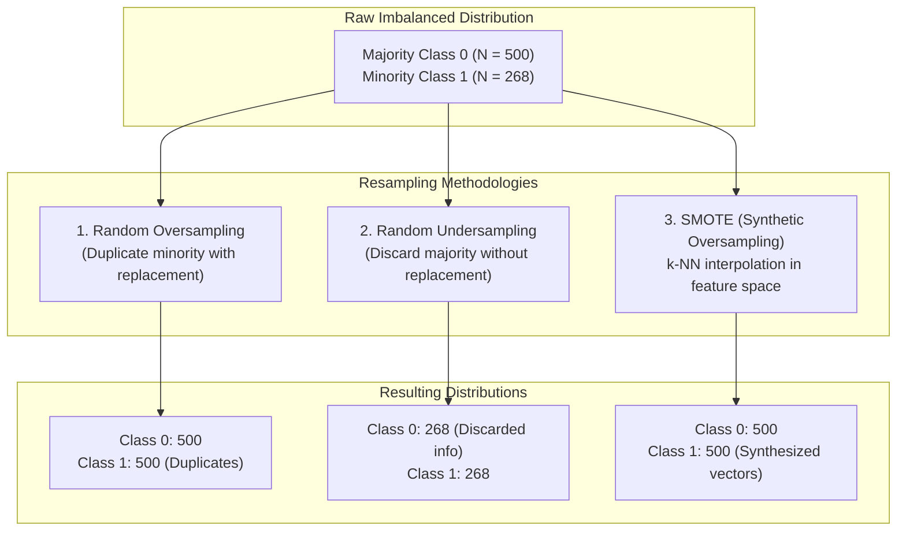

# Imbalanced Classification via Resampling Techniques

> An empirical study of class-balancing methodologies—Random Oversampling, Random Undersampling, and Synthetic Minority Over-sampling Technique (SMOTE)—applied to clinical diagnostic prediction on the Pima Indians Diabetes dataset.

[](https://www.python.org/)
[](https://scikit-learn.org/)
[](https://imbalanced-learn.org/)
[](https://pandas.pydata.org/)

[Repository](https://github.com/Rohitk69992/Handling-Imbalanced-Dataset-Using-Resampling-Technique) • [Dataset Schema](#dataset-profile--class-distribution) • [Resampling Methodologies](#resampling-methodologies--formulations) • [Notebook Walkthrough](#experimental-workflow) • [Quickstart](#reproduction--setup)

---

## Overview

In clinical diagnostic systems and medical decision support, class imbalance presents a significant risk to model validity. When disease occurrence is less frequent than negative diagnosis, conventional objective functions (e.g. cross-entropy or mean squared error) incentivize models to favor the majority class, achieving superficially high global accuracy while suffering high false-negative rates. In clinical settings, failing to identify a disease positive carries severe health consequences.

This project investigates and benchmarks foundational data-level resampling techniques to rectify class imbalance on the **Pima Indians Diabetes Dataset** (`diabetes.csv`).

### Core Research Questions
1. How does naïve random oversampling compare with synthetic interpolation (SMOTE) in preserving feature covariance?
2. What are the variance-reduction versus information-loss trade-offs associated with majority undersampling?
3. How do resampling transformations impact class balance across medical diagnostic indicators?

---

## Key Features

- **Empirical Class Imbalance Profiling:** Systematic analysis of class skew across 768 patient records with diagnostic physiological attributes.
- **Naïve Resampling Implementations:** Non-parametric random oversampling (with replacement) and random undersampling (without replacement) using Scikit-Learn utilities.
- **Synthetic Feature Space Expansion (SMOTE):** Implementation of $k$-nearest neighbor feature interpolation via `imbalanced-learn` to prevent exact-sample replication.
- **Comparative Distribution Visualization:** Multi-panel visual comparisons with Seaborn and Matplotlib charting class parity before and after resampling interventions.

---

## Dataset Profile & Class Distribution

The repository utilizes the **Pima Indians Diabetes Dataset** (`diabetes.csv`), originally from the National Institute of Diabetes and Digestive and Kidney Diseases (NIDDK):

### 1. Feature Specifications
| Feature | Type | Clinical Description |
| :--- | :--- | :--- |
| `Pregnancies` | Integer | Number of times pregnant |
| `Glucose` | Integer | Plasma glucose concentration at 2 hours in an oral glucose tolerance test |
| `BloodPressure` | Integer | Diastolic blood pressure (mm Hg) |
| `SkinThickness` | Integer | Triceps skin fold thickness (mm) |
| `Insulin` | Integer | 2-Hour serum insulin ($\mu$U/ml) |
| `BMI` | Float | Body mass index ($\text{weight in kg}/(\text{height in m})^2$) |
| `DiabetesPedigreeFunction` | Float | Genetic pedigree scoring metric |
| `Age` | Integer | Age in years |
| **`Outcome`** | **Binary Target** | **$0$: Negative for Diabetes, $1$: Positive for Diabetes** |

### 2. Baseline Distribution
- **Total Patient Records:** 768
- **Class 0 (Negative - Majority):** 500 samples (~65.1%)
- **Class 1 (Positive - Minority):** 268 samples (~34.9%)
- **Baseline Imbalance Ratio:** ~1.87 : 1

---

## Resampling Methodologies & Formulations



### 1. Naïve Random Oversampling (`main.ipynb`)
Minority samples are drawn uniformly with replacement until $|C_1| = |C_0|$:
$$\mathcal{S}_{\text{minority}} \sim \text{Uniform}(\mathcal{D}_{\text{minority}}), \quad N_{\text{new}} = 500$$
- **Advantage:** Preserves all majority class information; zero data discarded.
- **Disadvantage:** Creates exact feature duplicates, increasing the risk of overfitting in high-capacity classifiers.

### 2. Naïve Random Undersampling (`main.ipynb`)
Majority samples are drawn uniformly without replacement until $|C_0| = |C_1|$:
$$\mathcal{S}_{\text{majority}} \sim \text{Subsample}(\mathcal{D}_{\text{majority}}, k=268)$$
- **Advantage:** Reduces dataset cardinality and computational training footprint.
- **Disadvantage:** Discards 232 valid patient profiles (~46.4% of majority information), potentially pruning critical boundary decision surfaces.

### 3. Synthetic Minority Over-sampling Technique (`SMOTE.ipynb`)
Rather than duplicating instances, SMOTE generates synthetic feature vectors along line segments connecting $k$-nearest minority neighbors:
$$\mathbf{x}_{\text{new}} = \mathbf{x}_i + \lambda (\mathbf{x}_{zi} - \mathbf{x}_i), \quad \lambda \sim U(0, 1)$$
where $\mathbf{x}_i \in \mathcal{D}_{\text{minority}}$ and $\mathbf{x}_{zi}$ is one of its $k$-nearest minority neighbors ($k=5$ default).
- **Advantage:** Breaks exact sample ties, synthesizing broader regional decision regions in the minority class manifold.
- **Consideration:** Can synthesize noisy vectors if minority instances overlap with the majority class boundary in unscaled feature space.

---

## Experimental Workflow

The repository is organized into two dedicated experimental notebooks:

### 1. `main.ipynb`
- Ingestion of raw dataset and calculation of class frequencies via `collections.Counter`.
- Extraction of majority and minority slices using Pandas boolean indexing.
- Application of `sklearn.utils.resample` to achieve parity for oversampling and undersampling.
- Visualization of class distribution bar charts and feature distributions before and after resampling.

### 2. `SMOTE.ipynb`
- Isolation of feature matrix $\mathbf{X} \in \mathbb{R}^{768 \times 8}$ and target vector $\mathbf{y} \in \{0, 1\}^{768}$.
- Instantiation and execution of `imblearn.over_sampling.SMOTE()`.
- Generation of synthetic feature vectors, balancing the cohort to 500 negative and 500 positive records.
- Side-by-side distribution plots comparing original and SMOTE-augmented outcome frequencies.

---

## Project Structure

```bash
Handling-Imbalanced-Dataset-Using-Resampling-Technique/
├── diabetes.csv    # Pima Indians Diabetes dataset (768 patient observations)
├── main.ipynb      # EDA, Random Oversampling, and Random Undersampling experiments
├── SMOTE.ipynb     # SMOTE synthetic oversampling implementation and distribution plots
└── README.md
```

---

## Reproduction & Setup

### Prerequisites
- Python 3.9+
- Jupyter Notebook or JupyterLab

### 1. Clone the Repository
```bash
git clone https://github.com/Rohitk69992/Handling-Imbalanced-Dataset-Using-Resampling-Technique.git
cd Handling-Imbalanced-Dataset-Using-Resampling-Technique
```

### 2. Install Required Dependencies
```bash
pip install numpy pandas scikit-learn imbalanced-learn matplotlib seaborn jupyter
```

### 3. Run Experiments
```bash
jupyter notebook
```
Open and execute `main.ipynb` or `SMOTE.ipynb` sequentially.

---

## Technical Stack

| Layer | Technology | Purpose |
| :--- | :--- | :--- |
| **Language** | Python 3.10+ | Core analytical programming |
| **Resampling Engine** | Imbalanced-Learn (`imblearn`) | Synthetic oversampling implementation (SMOTE) |
| **Machine Learning Utilities** | Scikit-Learn | Resampling algorithms, array manipulations |
| **Data Manipulation** | Pandas, NumPy | Tabular loading, slicing, and feature matrix preparation |
| **Visualization** | Matplotlib, Seaborn | Distribution bar charts and comparison plots |
| **Environment** | Jupyter Notebook | Interactive code execution and data exploration |

---

## Limitations & Methodological Recommendations

- **Absence of Model Training & Cross-Validation:** Current notebooks focus strictly on data-level resampling and distribution changes. In production workflows, resampling must be applied **exclusively within cross-validation training folds** (e.g. via `imblearn.pipeline.Pipeline`) to prevent data leakage into validation splits.
- **Feature Scaling:** SMOTE computes Euclidean distances across raw features. Physiological variables with large magnitudes (e.g. `Insulin`, `Glucose`) exert disproportionate influence on nearest-neighbor selection unless standard scaling (`StandardScaler`) is applied beforehand.
- **Future Benchmark Scope:** Future extensions can benchmark downstream classification models (Logistic Regression, Random Forest, XGBoost) using Precision-Recall AUC (PR-AUC) and F1-score to empirically quantify performance gains across techniques.

---

## Author

**Rohit K.**  
*AI & Data Science Student*  
GitHub: [@Rohitk69992](https://github.com/Rohitk69992)
